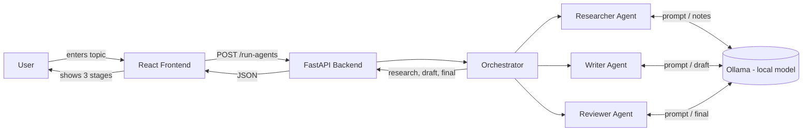

# Agentic AI Demo — Researcher → Writer → Reviewer

A very small example of an **agentic AI application**: three cooperating
agents (Researcher, Writer, Reviewer) that hand work off to each other in
sequence to turn a single topic into a reviewed, polished article — all
running on a **local Ollama model**, no cloud API keys needed.

See [docs/flow-diagram.md](docs/flow-diagram.md) for the full flow diagram
and an explanation of how the agents talk to each other.

## Tech stack

| Layer          | Tech                                   |
|----------------|-----------------------------------------|
| AI model       | Ollama, running locally (`llama3.2:3b`) |
| Backend        | Python, FastAPI                         |
| Frontend       | React (Vite)                            |
| Infrastructure | Docker Compose (optional)               |
| Quick start    | Windows `.bat` scripts                  |

## Prerequisites

- [Ollama](https://ollama.com) installed and on your PATH.
- Python 3.10+
- Node.js 18+

The `llama3.2:3b` model will be pulled automatically by `setup.bat` if you
don't already have it (`ollama pull llama3.2:3b`).

## Quick start (Windows, one click)

```bash
setup.bat
```

Run this once. It creates a Python virtual environment, installs backend
and frontend dependencies, and pulls the Ollama model if needed.

```bash
run.bat
```

Run this any time you want to use the app. It starts Ollama (if not
already running), the FastAPI backend on `http://localhost:8000`, the React
frontend on `http://localhost:5173`, and opens it in your browser.

## Running with Docker instead

An alternative, containerized setup is provided in [infra/docker-compose.yml](infra/docker-compose.yml).
It runs the backend and frontend in containers, connecting to your
**host machine's** Ollama instance:

```bash
cd infra
docker compose up --build
```

## Project layout

```
backend/
  agents/
    researcher.py     # Agent 1: gathers research notes on the topic
    writer.py          # Agent 2: drafts a short article from the notes
    reviewer.py         # Agent 3: critiques the draft and finalizes it
    ollama_client.py   # Shared helper that calls the local Ollama API
  orchestrator.py       # Runs the 3 agents in sequence
  main.py                # FastAPI app exposing POST /api/run
frontend/
  src/App.jsx            # UI: enter a topic, see each agent's output
infra/
  docker-compose.yml    # Optional containerized setup
docs/
  flow-diagram.md        # Mermaid diagram of the agent pipeline
setup.bat                # One-time install
run.bat                  # One-click start
```

## How the agents work together

1. You type a **topic** in the frontend.
2. **Researcher Agent** turns it into a handful of factual bullet points.
3. **Writer Agent** turns those notes into a short draft article.
4. **Reviewer Agent** critiques the draft and produces the final version.
5. All three outputs are shown in the UI so you can see each step of the
   pipeline, not just the end result.

Each agent is just the *same* local model called with a different system
prompt/role — the "multi-agent" behavior comes from the orchestration
(sequential hand-off of state), not from needing multiple different
models.

# Agentic AI Demo — 3 Agents on Local Ollama

A minimal example of an **agentic AI application**: 3 small agents cooperating
on one task, each a separate LLM call with its own role, chained together by
a simple orchestrator. No agent framework, no cloud API — everything runs
against your local Ollama install.

## The 3 agents

| # | Agent | Job |
|---|-------|-----|
| 1 | **Researcher** | Given a topic, produces 4-6 factual bullet points |
| 2 | **Writer** | Turns those bullet points into a short draft explainer |
| 3 | **Reviewer** | Checks the draft against the notes, outputs the polished final version |

They run in a straight line (no back-and-forth loop) to keep the example
easy to follow: `Researcher -> Writer -> Reviewer -> Final answer`.

## Flow diagram



## Tech stack

- **Backend:** Python, FastAPI, `requests` (calls Ollama's REST API directly — no SDK needed)
- **Frontend:** React 18 + Vite
- **Model runtime:** Ollama, running locally (you already have it installed)
- **Infra:** `docker-compose.yml` (optional containerized path)

## Project layout

```
agentic-ai-demo/
├── backend/
│   ├── agents.py         # the 3 agent classes
│   ├── orchestrator.py   # chains them together
│   ├── main.py           # FastAPI app (POST /run-agents)
│   ├── requirements.txt
│   ├── .env.example
│   └── Dockerfile
├── frontend/
│   ├── src/App.jsx        # the UI (topic box + 3 result panels)
│   ├── src/main.jsx
│   ├── src/App.css
│   ├── index.html
│   ├── package.json
│   └── Dockerfile
├── docker-compose.yml     # infrastructure file (optional, containers)
├── setup.bat              # setup file — installs Python + Node deps
├── run.bat                # one-click run — starts both servers + opens browser
└── README.md
```

## Prerequisites

1. **Ollama** installed and running (you already have this). Pull a model once:
   ```
   ollama pull llama3
   ```
   (Any chat-capable model works — just update `OLLAMA_MODEL` in
   `backend/.env.example` / your `.env` if you use a different one.)
2. **Python 3.10+** on PATH (`python --version`)
3. **Node.js 18+** on PATH (`node --version`)

## Run it (Windows, native — recommended for this demo)

1. Double-click **`setup.bat`** once. It creates a Python virtual environment,
   installs backend dependencies, and runs `npm install` for the frontend.
2. Double-click **`run.bat`**. It starts the FastAPI backend
   (`http://localhost:8000`) and the React dev server
   (`http://localhost:5173`) in two windows, then opens your browser.
3. Type a topic (e.g. "Why is the sky blue?") and click **Run**. You'll see
   the Researcher's notes, the Writer's draft, and the Reviewer's final
   answer appear in sequence.

`run.bat` will call `setup.bat` automatically the first time if you skip
step 1.

## Run it with Docker instead (optional)

Ollama still runs on your host machine either way. From the project root:

```
docker compose up --build
```

Backend: `http://localhost:8000`, Frontend: `http://localhost:5173`.

## API

`POST /run-agents`
```json
{ "topic": "Why is the sky blue?" }
```
returns
```json
{
  "topic": "...",
  "research": "...",   // Researcher Agent output
  "draft": "...",      // Writer Agent output
  "review": "...",     // raw Reviewer Agent output
  "final": "..."       // cleaned-up final answer shown in the UI
}
```

## Notes / where to take this further

- This is intentionally linear — a natural next step is to let the Reviewer
  send the draft *back* to the Writer with feedback (a loop) instead of
  finalizing in one pass.
- Swap `OLLAMA_MODEL` per agent if you want, e.g. a fast small model for the
  Researcher and a stronger model for the Reviewer.
- The "agents" here are just prompts + one function call each — real agent
  frameworks (LangGraph, CrewAI, etc.) add things like tool-calling, memory,
  and branching, but the core idea (role + prompt + orchestration) is the
  same as what's here.

