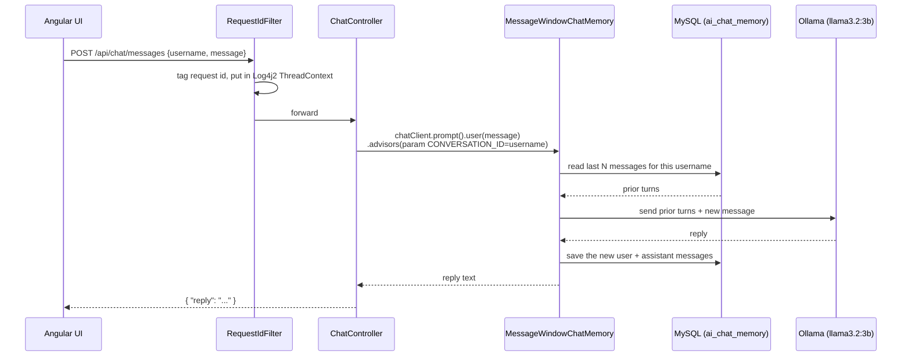

# Architecture

## Components

```
┌─────────────────────────────────────────────────────────────┐
│ Angular frontend (frontend/)                                │
│   features/chat/ (chat.component + message-list/input)      │
│   → core/services/chat.service.ts → HttpClient               │
└───────────────────────────────┬───────────────────────────────┘
                                 │ HTTP (JSON)
┌───────────────────────────────▼───────────────────────────────┐
│ chat-memory-app backend (backend/, com.example.chatapp)      │
│                                                               │
│  controller/  ChatController (POST/GET /api/chat/messages),  │
│               GlobalExceptionHandler                          │
│  config/      ChatMemoryConfig (ChatClient + ChatMemory       │
│               beans), ChatModelProperties, WebConfig (CORS)   │
│  logging/     RequestIdFilter (X-Request-Id, Log4j2 ThreadContext) │
│  model/       ChatRequest, ChatResponse, ChatMessageDto,      │
│               ErrorResponse                                   │
└──────────────┬────────────────────────────────┬───────────────┘
               │ spring-ai-starter-model-ollama  │ JdbcChatMemoryRepository
┌──────────────▼──────────────┐   ┌──────────────▼───────────────┐
│ Ollama (host machine)       │   │ MySQL (ai_chat_memory table) │
│ llama3.2:3b                 │   │ via Docker Compose            │
└──────────────────────────────┘   └───────────────────────────────┘
```

## One chat turn



`GET /api/chat/messages?username=...` follows the same idea in reverse: it reads directly from
`ChatMemory.get(username)` (backed by the same MySQL table) without calling Ollama at all — used
by the frontend to redisplay history after a page reload.

## Why MySQL instead of the reference project's H2

The section04 reference project uses a local H2 file for chat memory, fine for a course demo on
one machine. Swapping to MySQL (`schema-mysql.sql`, auto-detected via
`MysqlChatMemoryRepositoryDialect` inside `spring-ai-model-chat-memory-repository-jdbc`) makes
the memory a real, shared, restart-proof store — several backend instances (or a
containerized deployment where the JVM itself is disposable) could all point at the same
database and see the same conversation history.

## Why no separate "common-lib" module here

`employee-support-system` (a larger app built earlier) split reusable exception-handling and
correlation-id logic into its own Maven module because it anticipated a second service reusing
it. This app is deliberately small and single-purpose, so `RequestIdFilter` and
`GlobalExceptionHandler` are kept as plain classes in the one module — the same pattern, just
without the multi-module ceremony that a "small chat application" doesn't need yet.
