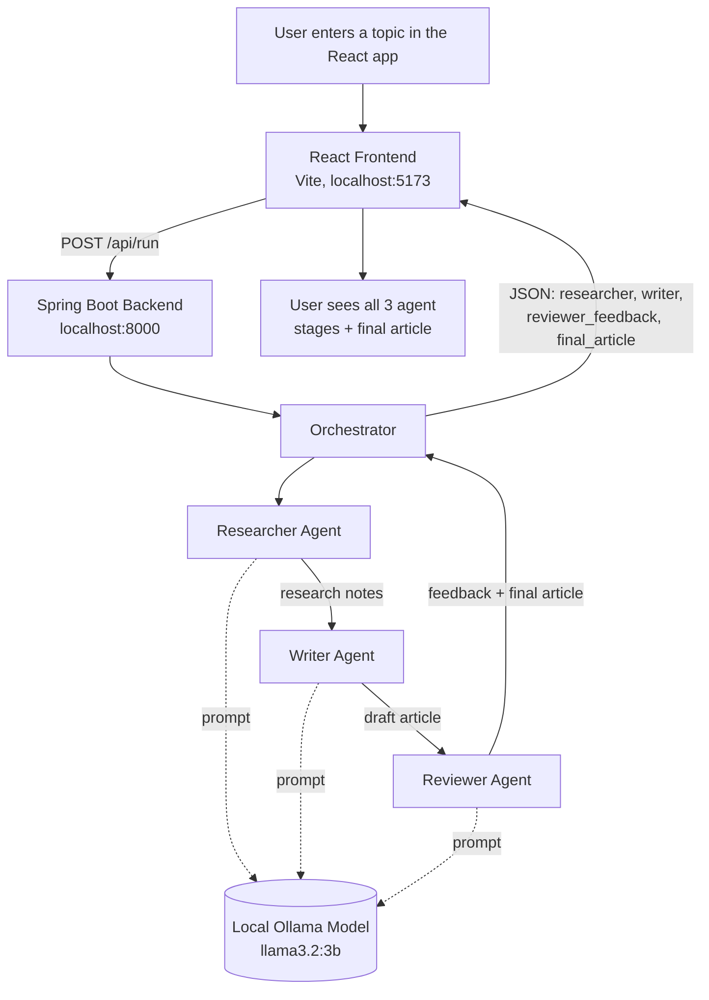

# Agent Flow Diagram

## How it works

1. **User** types a topic into the React frontend and clicks **Run**.
2. The frontend sends the topic to the Spring Boot backend's `/api/run` endpoint.
3. The backend **orchestrator** runs three agents **sequentially**, each a separate
   call to the same local **Ollama** model (`llama3.2:3b`) with a different system
   prompt/role:
   - **Researcher Agent** — turns the topic into 4-6 factual bullet points.
   - **Writer Agent** — turns those bullet points into a short draft article.
   - **Reviewer Agent** — critiques the draft and produces a final, polished article.
4. The backend returns all four pieces (research notes, draft, feedback, final
   article) as one JSON response, and the frontend renders each agent's output
   as its own card so you can see the pipeline step by step.
